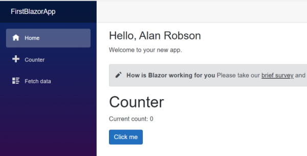

# Learning Blazor

Check your version of .Net

```cmd
	dotnet --version
```

> 6.00.300

Get a list of Blazor help options.

```cmd
	dotnet --help
```

Create a new .Net application

```cmd
	dotnet new
```

Will show you a small list of .Net templates that are available.

Run the following command to see a full list of templates.

```cmd
	dotnet new --list
```

The two templates we are interested in are:

> Blazor Server App      blazorserver [C#] Web/Blazor         
> Blazor WebAssembly App blazorwasm   [C#] Web/Blazor/WebAssembly/PWA

### Create a new Blazor app

```cmd
	dotnet new blazorserver -o FirstBlazorApp
```

Navigate to the folder.

```cmd
	cd FirstBlazorApp
```

Open this with Visual Server.

## Beginning Blazor components

All files in a Blazor application that have the extension ``.razor`` are components.

Create a component named **Name.razor** and give it ``first`` and ``last`` name parameters.

```c#
	<span>@FirstName @LastName</span>
	
	@code {
		[Parameter]
		public string? FirstName { get; set; }
	
		[Parameter]
		public string? LastName { get; set; }
	}
```

I can add it to my Index.razor page.

```c#
	@page "/"
	
	<PageTitle>Index</PageTitle>
	
	<div><h3>Hello, <Name FirstName="Alan" LastName="Robson" /></h3></div>
	
	Welcome to your new app.
	
	<SurveyPrompt Title="How is Blazor working for you" />
```

Output:



### Update the Counter.razor page

At the moment the counter on this page is set to increment by 1. What if we want to increment by a greater number than 1?

We can do this by adding a parameter to the counter component. We will call this parameter **IncrementBy**.

```c#
	@page "/counter"
	
	<PageTitle>Counter</PageTitle>
	
	<h1>Counter</h1>
	
	<p role="status">Current count: @currentCount</p>
	
	<button class="btn btn-primary" @onclick="IncrementCount">Click me</button>
	
	@code {
		private int currentCount = 0;
	
		[Parameter]
		public int IncrementBy { get; set; } = 1;
	
		private void IncrementCount()
		{
			currentCount += IncrementBy;
		}
	}
```

Note, the **[Parameter]** attribute allows us to state that the Counter component has a parameter named **IncrementBy**. We don't have to add this parameter and the counter will increment by the default value of 1. If we add a parameter it will increment by that ``IncrementBy`` value.

We will add a Counter component t o our Index page.

```c#
	@page "/"
	
	<PageTitle>Index</PageTitle>
	
	<div><h3>Hello, <Name FirstName="Alan" LastName="Robson" /></h3></div>
	
	Welcome to your new app.
	
	<SurveyPrompt Title="How is Blazor working for you" />
	
	<Counter IncrementBy="5" />
```

In this case the counter on the Index page will increment by 5.

If I go to the Counter page it will still be incrementing by 1 because there is no ``IncrementBy`` parameter on this page.

By doing this we can get the counter component to work two different ways.
